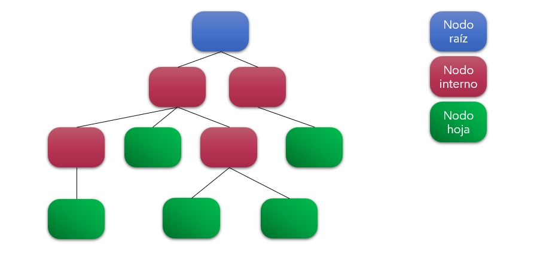

# Machine Learning

- Aprendizaje automático
- Subcampo de las ciencias de la computación, que otorga a las computadoras la capacidad de aprender sin ser explícitamente programadas.
- Aprenden a través de la experiencia.
- Probalidad de que una computadora realice correctamente la tarea mejorando con la experiencia.
- Tres tipos de aprendizaje:
  - Supervisado
  - No supervisado
  - Por refuerzo
- Permite a las computadoras aprender automáticamente a traves de la experiencia al trabajar con datos a gran escala, descubriendo patrones y tomando decisiones con poca intervención humana.

## Aprendizaje Supervisado

- Tipo de algortimo de machine learning que implica que vamos a entrenar un modelo para poder predecir valores de salida que estén basados en los datos de entrada.
- Primero se proporcionan datos con respuestas correctas, y luego la computadora aprende a predecir las respuestas correctas a partir de los datos de entrada.
- Lo esperado es que la computadora de respuestas correctas a datos que no había visto antes basándose en los datos de entrada.
- Algortimos:
  - Regresión lineal
  - Regresión logística
  - Árboles de decisión
  - Bosques aleatorios
  - Máquina de vectores de soporte
  - K vecinos mas cercanos
  - Redes neuronales
  - Boosting
  - etc

### Regresión lineal

- Método estadístico que se utiliza para predecir valores numéricos basándonos en un entrenamiento previo para conocer la relación entre las variables de entrada y las variable de salida.
- Encontrar un función lineal que se ajuste mejor a los datos de entrenamiento.

### Regresión logística

- Basándose en la información que le damos aprende a distinguir entre dos opciones posibles (como si o no). 
- Predecir que tan probable es que algo sea si o no.

### Árboles de decisión

- Un gran árbol de si y no, donde cada pregunta divide a los datos en nuevas ramas basándose en sus características hasta llegar a una predicción.

- El objetivo es crear una especie de árbol como el de la imagen que sea capaz de predecir lo más preciso posible en qué categoria pertenecen los nuevos datos.

### Bosques aleatorios

- Puede usarse para hacer regresión o clasificación.
- Combinar múltiples árboles de decisión para luego hacer una prediccion final.
- Pueden manejar un número mayor de datos.